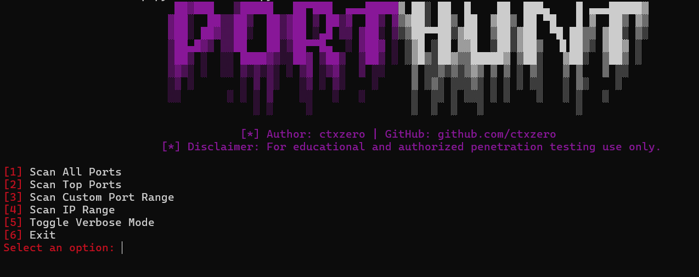

<div align="center">
  
# 🎯 PortHunt - Lightning-fast Port Scanner with Vulnerability Intelligence

<div align="center">



**Blazing fast TCP port scanner with multi-source vulnerability lookup**

[](https://www.python.org/downloads/)
[](https://opensource.org/licenses/MIT)
[](http://makeapullrequest.com)
[](https://ctxzero.dev/PortHunt)
[](https://discord.gg/KqVkdYN6yr)

[Features](#features) • [Installation](#installation) • [Usage](#usage) • [Demo](#demo) • [Legal](#legal) •
[Website](https://ctxzero.dev/PortHunt) • [Discord](https://discord.gg/KqVkdYN6yr)


</div>

---

## 🔥 Why PortHunt?

**10x faster** than traditional scanners with **real-time vulnerability intelligence**

- ⚡ **Insane Speed**: Multi-threaded scanning with optimized presets (slow/normal/fast/aggressive)
- 🔍 **Smart Detection**: Banner grabbing + TLS cert parsing + version fingerprinting  
- 🛡️ **Vuln Intelligence**: Aggregates CVEs from **NVD + CIRCL + Exploit-DB** in real-time
- 📊 **Beautiful Reports**: Export to HTML/JSON with clickable CVE links
- 🌐 **Range Scanning**: CIDR notation + host discovery (ping sweep)
- 🎨 **Clean UI**: Color-coded terminal output + verbose mode

---

## 📦 Features

### Scan Modes
- **Full Port Scan** (1-65535) with intelligent timeout scaling
- **Top 1000 Ports** for quick reconnaissance  
- **Custom Port Ranges** (e.g., `80,443,8000-8100`)
- **IP Range Discovery** with CIDR support (`192.168.1.0/24`)

### Intelligence Gathering
- Banner grabbing for service detection
- TLS/SSL certificate parsing (issuer, expiry, SANs)
- HTTP header analysis + server fingerprinting
- MySQL version extraction from banners

### Vulnerability Lookup (Multi-Source)
- 🔴 **NVD** (National Vulnerability Database)  
- 🟢 **CIRCL** (cve.circl.lu)  
- 🟡 **Exploit-DB** (offensive-security repo)

### Export & Reporting
- JSON reports with structured data
- HTML reports with embedded CVE links
- Timestamp + scan metadata

---

## 🚀 Installation

### Prerequisites
- Python 3.8 or higher
- Windows/Linux/macOS

### Quick Start

```powershell
# Clone the repository
git clone https://github.com/ctxzero/PortHunt.git
cd PortHunt

# Create virtual environment
python -m venv .venv

# Activate venv
# Windows PowerShell:
.\.venv\Scripts\Activate.ps1
# Linux/Mac:
source .venv/bin/activate

# Install dependencies
pip install -r requirements.txt

# Run PortHunt
python PortHunt.py
```

---

## 💻 Usage

### Interactive Menu
```bash
python PortHunt.py
```

**Menu Options:**
1. **Scan All Ports** - Full TCP scan (1-65535)
2. **Scan Top Ports** - Quick scan of 1000 most common ports
3. **Custom Port Range** - User-defined ports (e.g., `22,80,443,8000-9000`)
4. **IP Range Scan** - CIDR/range with host discovery (`192.168.1.0/24`)
5. **Toggle Verbose** - Debug logging
6. **Exit**

### Scan Presets
- **slow** → High accuracy, low noise (pentests, strict firewalls)
- **normal** → Balanced (default, recommended)
- **fast** → Quick recon (CTFs, time-limited)
- **aggressive** → Maximum speed (controlled environments only)

### Example Workflow
```bash
# Start PortHunt
python PortHunt.py

# Select option 2 (Top Ports)
[2] Scan Top Ports

# Enter target
Enter target IP address or hostname: scanme.nmap.org

# Choose preset
Choose Preset (slow, normal, fast, aggressive) [default: normal]: fast

# Review results + vulnerability intelligence
Search public vulnerability databases? (y/N): y

# Export report
Save scan + vuln report? (y/N): y
Format (json/html/both) [both]: both
```

---

## 🎬 Demo

### Sample Output
```
Starting Top-1000 port scan on 45.33.32.156 (scanme.nmap.org) using preset 'fast'...
Discovery complete. 4 open ports found: [22, 80, 443, 9929]

PORT      SERVICE              INFO/VERSION
22/tcp    SSH                  SSH-2.0-OpenSSH_6.6.1p1 Ubuntu-2ubuntu2.13
80/tcp    HTTP                 Apache/2.4.7 (Ubuntu)
443/tcp   HTTPS/TLS           Apache/2.4.7; TLS cert: CN=scanme.nmap.org
9929/tcp  Unknown Service      no response

Vulnerability lookup results
Port 80/tcp  Service: HTTP  Info: Apache/2.4.7 (Ubuntu)
  Candidate: Apache 2.4.7
    Source: NVD  (3)
      CVE-2017-9798  (2017-09-18)
        Apache HTTP Server 2.2.0 - 2.4.33: Use-after-free via Limit directive...
```

### Report Example


---

## ⚖️ Legal & Ethical Use

### ⚠️ DISCLAIMER
**FOR EDUCATIONAL AND AUTHORIZED TESTING ONLY**

- ✅ **Do**: Test systems you own or have explicit written permission to scan
- ✅ **Do**: Use in authorized penetration tests, CTFs, lab environments  
- ❌ **Don't**: Scan public infrastructure without permission (illegal in most jurisdictions)
- ❌ **Don't**: Use for malicious purposes or unauthorized access attempts

**The author assumes NO liability for misuse. You are responsible for compliance with local laws.**

---

## 🛠️ Technical Details

### Architecture
- **Discovery Phase**: Parallel TCP SYN connect with timeout scaling
- **Probing Phase**: Banner grabbing + TLS handshake + HTTP HEAD requests
- **Vuln Phase**: Async API queries with rate-limiting + caching (`@lru_cache`)

### Performance
| Preset      | Timeout | Workers | Typical Speed (1000 ports) |
|-------------|---------|---------|----------------------------|
| slow        | 600ms   | 40      | ~30s                       |
| normal      | 200ms   | 200     | ~8s                        |
| fast        | 120ms   | 320     | ~4s                        |
| aggressive  | 60ms    | 450     | ~2s                        |

*Speeds vary based on network conditions, target responsiveness, and firewall rules*

---

## 🤝 Contributing

Contributions welcome! Ideas:
- Add more vulnerability sources (Vulners, OSV, GitHub Advisories)
- UDP scanning module
- Service-specific probes (SMB, RDP, databases)
- CLI argument parser (argparse)
- Dockerfile + CI/CD

---
## :compass: Community

- :globe_with_meridians: Website: https://ctxzero.dev/PortHunt
- :speech_balloon: Discord: https://discord.gg/KqVkdYN6yr
- :bug: Issues: https://github.com/ctxzero/PortHunt/issues
- :star: Star this repo if it helped you!

---

## 📄 License

MIT License - see [LICENSE](LICENSE) file

---

## 👨‍💻 Author

**ctxzero**  
- GitHub: [@ctxzero](https://github.com/ctxzero)
- BuyMeACoffee: [@ctxzero](https://buymeacoffee.com/ctxzero)

---

## 🙏 Acknowledgments

- Inspired by nmap, masscan, and the infosec community
- Vulnerability data provided by NVD, CIRCL, and Exploit-DB

---

<div align="center">

**⭐ Star this repo if PortHunt helped you!**

Made with ❤️ for the red team community

</div>
